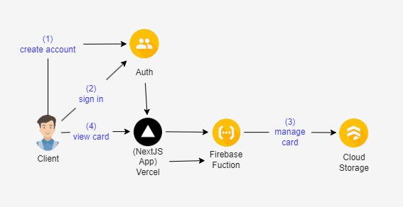

# Birthday Card Generator

## Introduction
Birthday cards are a great way to express a person's
feeling to the ones they cherish, but sometimes we forget
to prepare one or can't afford one (mainly due to distance).
 
 
This simple web application provides a solution for those
occasions by letting users to prepare a thoughtful message
wrapped in a nice visual, their digital birthday card, to send
to their love ones.

## Requirements
- Users can login using their google account.
- Users can create new digital birthday card while logged in.
- Users can view digital birthday cards while not logged in through unique urls for those cards.

## High Level Design

### Authentication
Use Firebase Auth to handles user authentication.
This also enable popup sign in with Google, or
as an anonymous user.

### Web client
A NextJS application to let user to sign in,
create, and share virtual birthday cards.
The web app will be hosted on Vercel as it
has first-class support for NextJS.

### Client Data Fetching
Most of the operations are simple and require
few calls to the db, so client-side fetching
with react hooks and firebase web sdk is the
fastest and easiest way to do this.

### Firebase cloud (Firestore)
For each card, user will need to specify the
recipient's name, birthday message, a signature
from the sender, and the unique link for that card. 
These information will be stored in a document in 
the `Cards` collection.

### React-Firebase-Hooks
An external library that makes integrating firebase
into the project easier with features like 
listener to get our user when a new user is created.

## Detailed design

### Create new cards
Ideally only authenticated users can create new cards
so they can edit and remove them. Also, it helps later on
when we need to enforce quota per user. (e.g. 5 cards total).
A unique url will be attached with each card.
 
 
Firebase's cloud storage provides a simple way to store
and query data so we will use that to store information
about each card.

### View cards
Users can shard their unique cards links that will will
give access to a view-only version of those cards. 